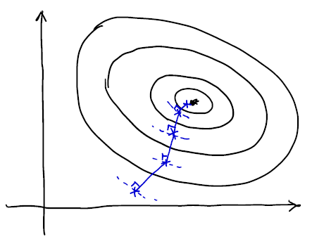
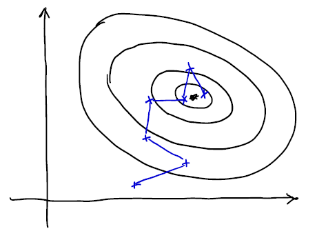

# CS229 Lecture 2 (1/4)

## Table of Contents

1. [Linear Regression](#linear-regression)
2. [Gradient Descent](#gradient-descent)
3. [Normal Equation]

# Linear Regression

<!-- ## An Application Of Supervised Learning : Autonomous Deriving, ALVINN

사람이 직접 운전하면서 카메라로 사진을 2초마다 한 번씩 찍으며 그 때의 운전대(바퀴) 각도 측정. (데이터셋 생성)
생성된 데이터셋을 이용하여 사진을 넣으면 운전대의 각도가 나오도록 supervised learning 진행.
출력이 연속적인 운전대의 각도이므로 regression problem으로 볼 수 있다.

학습된 길에서는 잘 다니지만 학습이 되지 않은 2차선 / 교차로에서 잘 다니지 못함. => 추가 학습 진행 -->

## Supervised learning

### Supervised learning process

![][supervised_learning_figure]

**_Learning Algorithm에 따라서 Training set을 이용하여 hypothesis ($h$)를 만든다._**  
**_Hypothesis ($h$)는 입력변수 $x$를 입력받아 참값 $y$를 예측하기 위한 시스템으로 예측값 $h(x)$를 출력한다._**  
Target variable $y$가 연속인 경우 regression problem, 불연속인 경우 classification problem이라고 한다.

## Notation

$m$ : # training examples  
$x$ : Input variable / feature  
$y$ : Output variable / target variable  
$(x, y)$ : Training example  
$(x^{(i)}, y^{(i)})$ : $i$-th training example

$h$ : Hypothesis  
Linear representation인 hypothesis의 경우,

$$
h(x) = h_\theta (x) = \theta_0 x_0 + \theta_1 x_1 + \theta_2 x_2 + ... = \sum_{j=0}^n \theta_j x_j  = \theta^T x
$$

where $x_0 := 1$  
$x_j$ : Value of $j$-th feature  
$\theta_j$ : $j$-th parameter  
$n$ : # features

## Cost function (Least Mean Square, LMS)

$$
\begin{aligned}
&J(\theta) := {1\over2} \sum_{i=1}^n(h_\theta (x^{(i)}) - y^{(i)})^2 \\ \\
&\text{then find,} \min_\theta J(\theta)
\end{aligned}
$$

# Gradient Descent

### Basic idea

$\min_\theta J(\theta)$인 $\theta$를 찾기 위해서 임의의 $\theta$에서 출발하여 $J(\theta)$를 감소시키는 방향으로 $\theta$를 변화시킨다.

## Algorithm (Batch Gradient Descent)

### Pseudo code

$$
\theta_j := \theta_j - \alpha {\partial \over {\partial \theta_j}} J(\theta) \tag{for every \textit{j}}
$$

where

$$
\begin{aligned}
{\partial \over \partial\theta_j} J(\theta) &= {\partial \over \partial\theta_j} {1 \over 2} (h_\theta (x) - y)^2 \\
&= 2 \cdot {1 \over 2} (h_\theta (x) - y) \cdot {\partial \over \partial\theta_j} (h_\theta (x) - y) \\
&= (h_\theta (x) - y) \cdot {\partial \over \partial\theta_j} \left(\sum_{i=0}^n \theta_i x_i -y\right) \\
&= (h_\theta (x) - y) x_j
\end{aligned}
$$

$\alpha$ : Learning rate (step size)

update every $\theta_j$ until convergence:

$$
\theta_j := \theta_j - \alpha \sum_{i=1}^n (h_\theta (x^{(i)}) - y^{(i)}) x_j^{(i)}
$$

## 단점

Gradient Descent는 **_Local Optima_**를 찾는 과정. (not Global Optima)  
그러므로 $J(\theta)$는 항상 Convex해야 한다. (Big bowl form. The only local optima is also the global optima)

## Stochastic Gradient Descent (SGD)

Batch Gradient Descent는 모든 Dataset을 전부 보고 난 뒤에 전부 더해서 한 번 Update.  
=> 매우 큰 Dataset에 대해서 굉장히 비싸고 느리다.  
일부의 데이터들만 (또는 하나) 본 뒤에 Update하는 방식을 고안.

| Batch Gradient Descent | Stochastic Gradient Descent |
| :--------------------: | :-------------------------: |
|        |             |

### Pseudo code

$$
\begin{aligned}
&\text{Repeat } \{ \\
&\quad \text{For i = 1 to m} \{ \\
&\quad\quad {\theta_j := \theta_j - \alpha {\partial \over {\partial \theta_j}} J(\theta) \quad \text{for every j}} \\
&\quad\} \\
&\}
\end{aligned}
$$

# Normal Equation

<!-- reference -->

[supervised_learning_figure]: img/Lecture2_2_Supervised_learning.png
