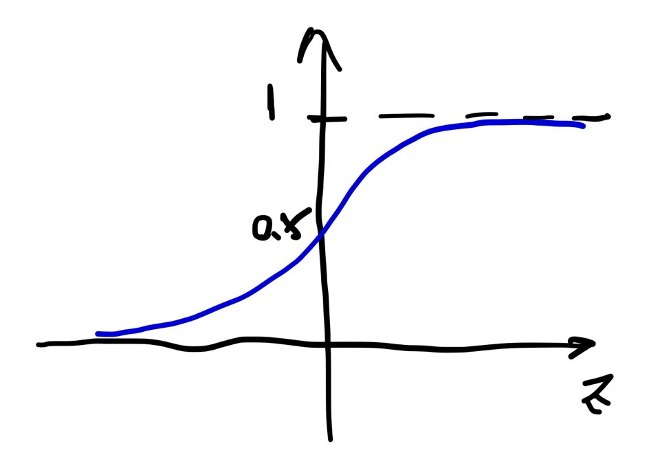
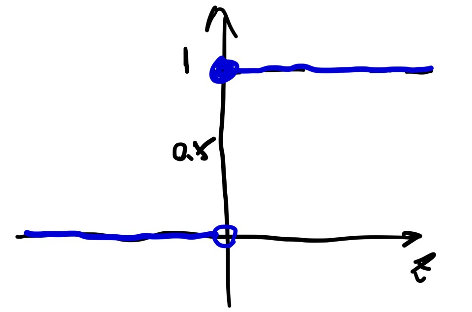
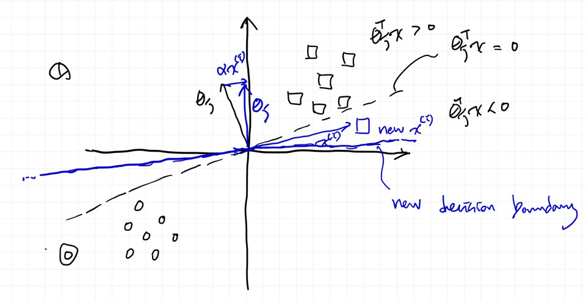

# Lecture 4 : Perceptron & Generalized Linear Model

## Information

- **Title:** (cs229) Lecture 4 : Perceptron & Generalized Linear Model
- **Link:** http://cs229.stanford.edu/notes2020fall/notes2020fall/cs229-notes1.pdf
- **Keywords:** Perceptron, Exponential Family, Generalized Linear Models, Softmax Regression (Multiclass Classification)

## TOC

1. Perceptron
2. Exponential Family
3. Generalized Linear Models
4. Softmax Regression (Multiclass Classification)

## Summary

### Perceptron

|             Sigmoid              |                            Perceptron                             |
| :------------------------------: | :---------------------------------------------------------------: |
|              |                                            |
| $$g(z)= {1 \over {1 + e^{-z}}}$$ | $$g(z) = \begin{cases}1, \quad z\geq0 \\0, \quad z<0\\\end{cases}$$ |

Lecturer's opinion : Sigmoid is a soft version of Perceptron.

### Perceptron learning algorithm

Where $h_\theta (x) = g(\theta^T x)$,

$$
\theta_j := \theta_j + \alpha (y^{(i)} - h_\theta (x^{(i)})) x_j^{(i)}
$$

Classify 1, if $\theta^T x < 0$  
Classify 0, if $\theta^T x > 0$

Then, $y^{(i)} - h_\theta (x^{(i)}) = \begin{cases}0 & z\geq0 \\1 & z<0\\-1 & z<0\\\end{cases}$

